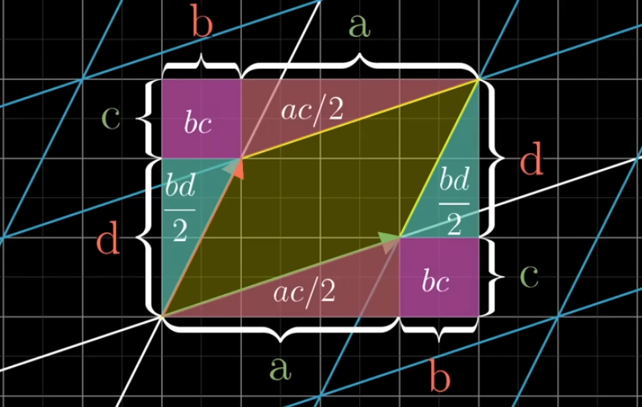
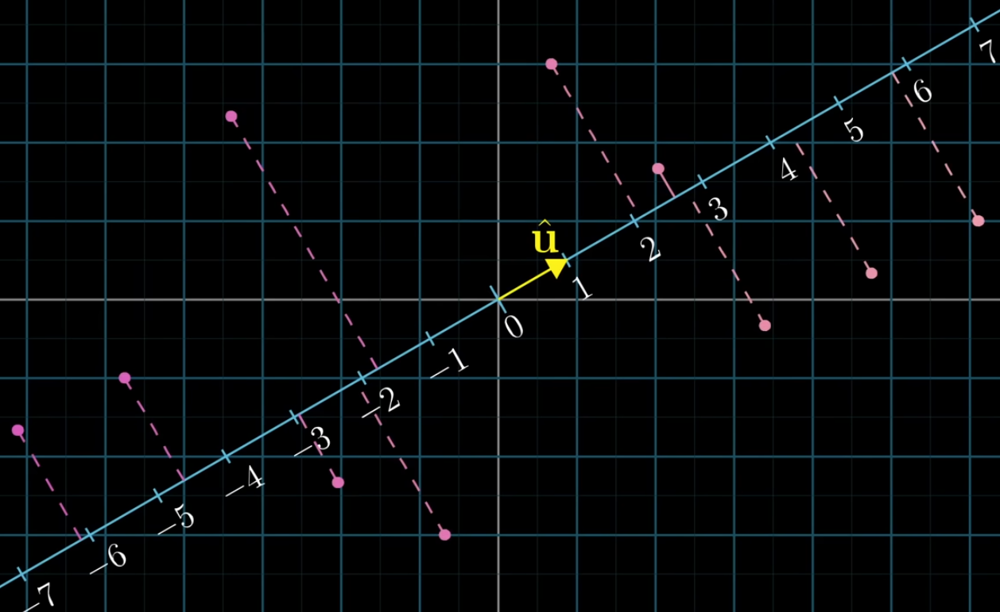
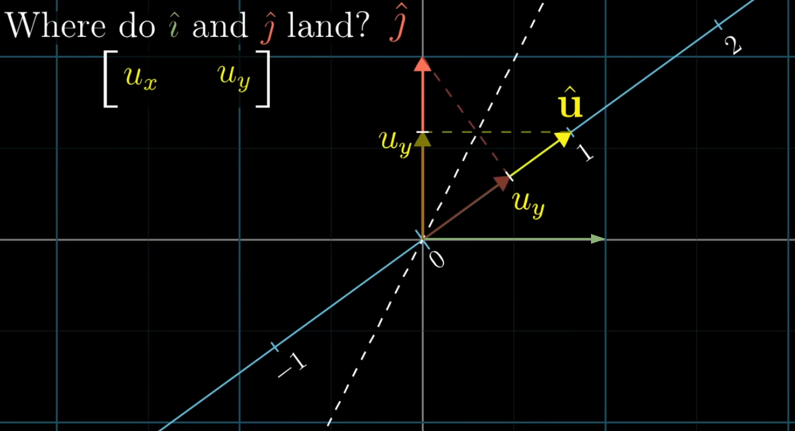
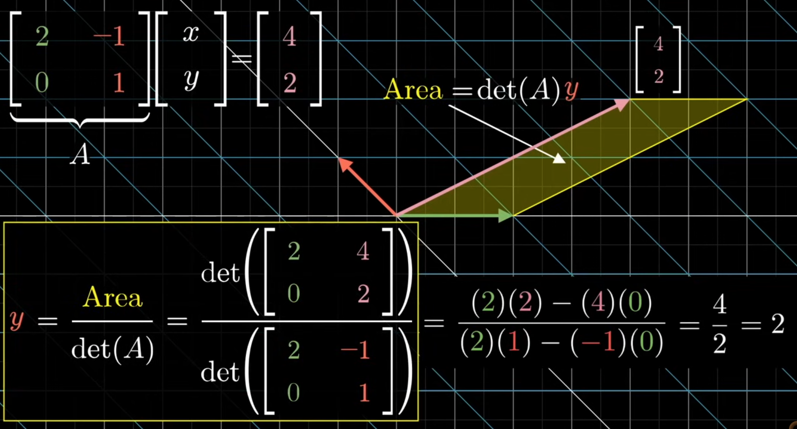
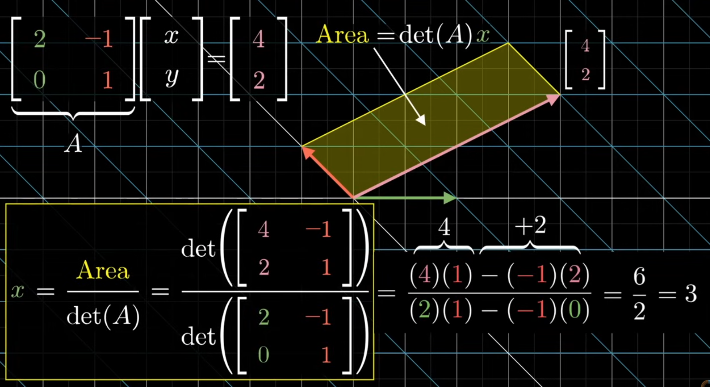

# Essence of Linear Algebra

## Chapter 1: Vectors
### What's a vector? — 3 Perspectives
1. Physics
    - an arrow sitting and pointing anywhere in space
    - defined by a direction and length
2. Computer Science
    - an ordered lists of numbers (order matters)
3. Mathematcis
    - anything that can be added or multiplied

### Vector Intuition
- an arrow inside a coordinate system with its tail at the origin
    - has same dimensions as the coordinate system
- coordinates of the tip of the arrow are the ordered list of numberrs
- i.e. these numbers tell us how to get from origin (tail) to arrrow's tip
- to distinguish them from points in coordinate system, we use square brackets
    - $\vec{v} =\begin{bmatrix} 1 \\ 2 \end{bmatrix}$

### Addition
```math
\begin{bmatrix} x_1 \\ y_1 \end{bmatrix} + \begin{bmatrix} x_2 \\ y_2 \end{bmatrix} = \begin{bmatrix} x_1 + x_2 \\ y_1 + y_2 \end{bmatrix}
```
- physics
    - 4-step movement: follow the 2 elements to the tip of 1st vector and from there follow 2 elements of 2nd vector to the tip of the new vector
- computer science
    - ordered list of number: it's matching up the the terms of each vector and adding them together
```math
\begin{bmatrix} 1 \\ 2 \end{bmatrix} + \begin{bmatrix} 3 \\ -1 \end{bmatrix} = \begin{bmatrix} 1 + 3 \\ 2 + (-1) \end{bmatrix} = \begin{bmatrix} 4 \\ 1 \end{bmatrix}
```

### Multiplication
- multiplying a vector by a number is stretching, squishing or flipping the vector along its original
    - stretching for n > 1
    - squishing for 0 < n < 1
    - with flipping for negative n 
- mathetically, this is called **scaling** and the number called **scalar**
```math
2 \cdot \begin{bmatrix} x \\ y \end{bmatrix} = \begin{bmatrix} 2x \\ 2y \end{bmatrix}
```
- applied that means mulitplying each component of the vector by the scalar

## Chapter 2: Basis Vector, Linear Combinations and Spans 
### Basis Vectors
- we defined vectors as arrow in coordinate system
- think of each coordinate of the vector as scalar itself
- in an xy-coordinate system, there are two special vectors
    1. $\hat{i}$, the unit vector pointing in x-direction
    2. $\hat{j}$, the unit vector pointing in y-direction
- then the x-coordinate of our vector stretches $\hat{i}$ and the y-coordinate stretches $\hat{j}$
```math
\begin{bmatrix} (x)\hat{i} \\ (y)\hat{j} \end{bmatrix} = (x)\hat{i} + (y)\hat{j}
```
- $\hat{i}$ and $\hat{j}$ are the **basis vectors** of the xy-coordinate system
    - by scaling these basis vectors you can reach every possible vector in the coordinate system
    - this is the implicit understanding of coordinate system (technical definition at chapter's end)

### Linear Combination & Span
- $a, b$ are scalars and  vary over all real numbers 
```math
a\vec{v} + b\vec{w}
```
- with this understanding, doing both addition and scalar multiplication on two vectors is called a **linear combination**
    - if you fix one scalar in this example and sample the other one freely, the tip of the resulting vectors will draw a line
- the **span** of $\vec{v}$ and $\vec{w}$ is the set all of their linear combinations
    - i.e. covering all coordinate pairs in our xy-coordinate space

### Vectors vs Points
- visualizing all vectors as arrows get becomes crowded, so we do show vectors points; the point being the tip of the arrow

### Spans in 3D Space
1. what's the span of 2 vectors in 3D space (a xyz-coordinate system)?
    - their span is still all the linear combination of those 2 vectors
    - but this span will trace out plane (a flat sheet) through the origin of this 3D space 
2. what's the span of 3 vectors in 3D space?
    - mathematically, it's the linear combination $a\vec{v} + b\vec{w}+ c\vec{u}$
    - if you add a new vector to the previous and vary its linear combinations, then it moves that plane of the original vectors through 3D space
    - thus covering all coordinate triplets in ourr xyz-coordinate space
- what if one vector is redundant meaning, it sits on the same line as another vector?
    - in 2D space, the span becomes a line
    - in 3D space, the span becomes the plane again
    - mathetically, redundant vectors are called **linearly dependent**
    - $\vec{u} = a\vec{v} + b\vec{w}$
    - or it is expressed as a time linear combination of an existing vector and thus already part of the span
- but if each vector adds a dimension to the span, then the vectors are **linearly independent**
    - $\vec{u} \ne a\vec{v} + b\vec{w}$

### Technical Definition of Basis
- > the basis of a vector space is a set of linearly independent vectors that span the full space

## Chapter 3: Linear Transformations and Matrices
### Matrices as Linear Transformations
- a transformation is a function like $f(x)$ which takes an input and gives an output
- in lin alg, such a function $L(\vec{v})$ takes an input vector and gives an output vector
- visually speaking, a transformation is linear if
    - all lines remrain lines
    - the origins remains in place
    - i.e. keeps grid lines parallel and evenly spaced
- numerically, we ca think of this transformation of the grid as the transformation of vector space with $\hat{i}, \hat{j}$ 
    - thus, we only need to understand how the basis vectors are transformed to deduce how any other vector will transformed
- example
    - transformation on $\hat{i}, \hat{j}$
```math
\hat{i} → \begin{bmatrix} 1 \\ -2 \end{bmatrix} \text{ } \hat{j} → \begin{bmatrix} 3 \\ 0 \end{bmatrix}
```
    - applying  $\hat{i}$ to x-coordinate and  $\hat{j}$ to y-coordinate
```math
\begin{bmatrix} x \\ y \end{bmatrix} → x \begin{bmatrix} 1 \\ -2 \end{bmatrix} + y \begin{bmatrix} 3 \\ 0 \end{bmatrix} = \begin{bmatrix} 1x + 3y \\ -2x + 0y \end{bmatrix}
```
- this means, we only need 4 numbers (for a 2D space) to describe any linear transformation
- these 4 numbers are expressed as **2x2 matrix**, where the two columns describe how $\hat{i}, \hat{j}$ are transformed, e.g.
```math
M = \begin{bmatrix} 3 & 2 \\ -2 & 1 \end{bmatrix}
```
    - now we can apply columns of the matrix to the corresponding elements of a vector $\vec{v}$
```math
\begin{align*}
M \vec{v} &= \begin{bmatrix} 3 & 2 \\ -2 & 1 \end{bmatrix} \begin{bmatrix} 5 \\ 7 \end{bmatrix} \\
& = 5 \begin{bmatrix} 3 \\ -2 \end{bmatrix} + 7 \begin{bmatrix} 2 \\ 1 \end{bmatrix} \\
& = \begin{bmatrix} 15 + 14 \\ -10 + 7 \end{bmatrix} \\
& = \begin{bmatrix} 29 \\ -3 \end{bmatrix}
\end{align*}
```

### 2x2 Matrix
- let's generalize this matrix as linear transformation of vectors
- the column $a, c$ tranforms the $\hat{i}$ and the column $b, d$ the $\hat{j}$ basis vectors
```math
\begin{bmatrix} a & b \\ c & d \end{bmatrix} \text{ }  \begin{bmatrix} x \\ y \end{bmatrix}\\
x \begin{bmatrix} a \\ c \end{bmatrix} + y \begin{bmatrix} c \\ d \end{bmatrix} = \begin{bmatrix} ax + by \\ cx + dy \end{bmatrix}
```
- these steps descibe **matrix-vector multiplication**

### Special Cases
- counter-clockwise rotation of 90°
```math
\begin{bmatrix} 0 & -1 \\ 1 & 0 \end{bmatrix}
```
- "shear": $\hat{i}$ remains fixed but $\hat{j}$ moves over
```math
\begin{bmatrix} 1 & 1 \\ 0 & 1 \end{bmatrix}
```
- linearly dependent: transforms 2D vector space into 1D vector space
```math
\begin{bmatrix} 2 & -2 \\ 1 & -1 \end{bmatrix}
```

### Summary
- linear transformation move around space such that gridlines remain parellel and evenly spaced, and the origin remains fixed
- matrices give us tool to describe these transformation in general and matrix multiplication with vector to apply them

### Technical Definition of Linear
- > a transformation is linear if it satisfies 2 properties
    > 1. additivity: $L(\vec{v} + \vec{w}) = L(\vec{v}) + L(\vec{w})$ 
    > 2. scaling: $L(c\vec{v}) = cL(\vec{v})$

## Chapter 4: Matrix Multiplication as Composition
### Recap
- linear transformation are functions with input vector and output vector $L(\vec{v}) = \vec{w}$
- we can think about the as stretching space such that grid lines stay parallel & evenly spaced, and so that origin remains fixed
- linear transformation are determined by where they take the base vectors $\hat{i}, \hat{j}$
- convention is a matrix where each column determines where base vector lands after transformation and the transformation is done by matrix-vector multiplication
```math
\begin{bmatrix} a & b \\ c & d \end{bmatrix} \begin{bmatrix} x \\ y \end{bmatrix} = x \begin{bmatrix} a \\ c \end{bmatrix} + y \begin{bmatrix} c \\ d \end{bmatrix} = \begin{bmatrix} ax + by \\ cx + dy \end{bmatrix}
```

### Composition
- how can we describe multitple (consecutive) linear transformations?
- i.e. 1st rotate, 2nd shear → gives a new distinct linear transformation
- this is called a **composition** of a rotation and a shear
- can be expressed as its own matrix with final position of $\hat{i}, \hat{j}$
    - you can always think of matrix multiplication visually as where the base vectors will finally land (even after multiple transformations)
- individual steps should be equal to composition method
    - 1st apply rotation matrix to vector
    - 2nd apply shear matrix to vector
    - or only apply composition matrix to vector 
```math
\begin{bmatrix} 1 & 1 \\ 0 & 1 \end{bmatrix} \left( \begin{bmatrix} 0 & -1 \\ 1 & 0 \end{bmatrix} \begin{bmatrix} x \\ y \end{bmatrix} \right) = \begin{bmatrix} 1 & -1 \\ 1 & 0 \end{bmatrix} \begin{bmatrix} x \\ y \end{bmatrix} 
```
- the composition matrix is the product of the original matrices
```math
\begin{bmatrix} 1 & 1 \\ 0 & 1 \end{bmatrix} \begin{bmatrix} 0 & -1 \\ 1 & 0 \end{bmatrix}  = \begin{bmatrix} 1 & -1 \\ 1 & 0 \end{bmatrix}
```
- multipying two matrices has geometric meaning of transforming the base vectors by one then another
- order of operations is right-to-left because of function notation $f(g(x))$

### Example
- multiply $M_2=\begin{bmatrix} 0 & 2 \\ 1 & 0 \end{bmatrix}$ by $M_1 = \begin{bmatrix} 1 & -2 \\ 1 & 0 \end{bmatrix}$
```math
\begin{bmatrix} 0 & 2 \\ 1 & 0 \end{bmatrix} \begin{bmatrix} 1 & -2 \\ 1 & 0 \end{bmatrix}  = \begin{bmatrix} ? & ? \\ ? & ? \end{bmatrix}
```
- step 1:
    - where does $\hat{i}$ land?
    - multiply $M_2$ by **left column** of $M_1$  using the matrix vector calculation
```math
\begin{bmatrix} 0 & 2 \\ 1 & 0 \end{bmatrix}  \begin{bmatrix} 1 \\ 1 \end{bmatrix} = 1 \begin{bmatrix} 0 \\ 1 \end{bmatrix} + 1 \begin{bmatrix} 2 \\ 0 \end{bmatrix} =  \begin{bmatrix} 2 \\ 1 \end{bmatrix}
```
    - this will be the **left column** of the composition matrix
- step 2:
    - where does $\hat{j}$ land?
    - multiply $M_2$ by **right column** of $M_1$  using the matrix vector calculation
```math
\begin{bmatrix} 0 & 2 \\ 1 & 0 \end{bmatrix}  \begin{bmatrix} -2 \\ 0 \end{bmatrix} = -2 \begin{bmatrix} 0 \\ 1 \end{bmatrix} + 0 \begin{bmatrix} 2 \\ 0 \end{bmatrix} =  \begin{bmatrix} 0 \\ -2 \end{bmatrix}
```
    - this will be the **right column** of the composition mat rix
- finally, the composition matrix is
```math
\begin{bmatrix} 0 & 2 \\ 1 & 0 \end{bmatrix} \begin{bmatrix} 1 & -2 \\ 1 & 0 \end{bmatrix}  = \begin{bmatrix} 2 & 0 \\ 1 & -2 \end{bmatrix}
```

### Generalization
- matrix-matrix multiplication
```math
\begin{bmatrix} a & b \\ c & d \end{bmatrix} \begin{bmatrix} e & f \\ g & h \end{bmatrix}  = \begin{bmatrix} ? & ? \\ ? & ? \end{bmatrix}
```
- 1: left column, where $\hat{i}$ lands
```math
\begin{bmatrix} a & b \\ c & d \end{bmatrix} \begin{bmatrix} e \\ g \end{bmatrix} = e \begin{bmatrix} a \\ c \end{bmatrix} + g \begin{bmatrix} b \\ h \end{bmatrix} =  \begin{bmatrix} ae + bg \\ ce + dg \end{bmatrix}
```
- 2: right column, where $\hat{j}$ lands
```math
\begin{bmatrix} a & b \\ c & d \end{bmatrix} \begin{bmatrix} f \\ h \end{bmatrix} = f \begin{bmatrix} a \\ c \end{bmatrix} + h \begin{bmatrix} b \\ h \end{bmatrix} =  \begin{bmatrix} af + bh \\ cf + dh \end{bmatrix}
```
- finally: composition matrix
```math
\begin{bmatrix} a & b \\ c & d \end{bmatrix} \begin{bmatrix} e & f \\ g & h \end{bmatrix}  = \begin{bmatrix} ae + bg & af + bh \\ ce + dg & cf + dh \end{bmatrix}
```
- order of operations matters $M_2 M_1 \ne M_1 M_2$, always from left to right
- but matrix multiplication is associative $(AB)C = A(BC)$
    - i.e. it doesn't matter if you multiply $AB$ or $BC$ first
    - since the order is fixed from left to right, it doesn't matter where you put the parenthesis
- the visual proof is better and easier to follow/understand than the symbolic proof 
    - visualize matrix multiplication as where the base vectors will land

## Chapter 5: 3D Linear Transformation
### Linear Transformation to Three Dimensions
- the concepts from two dimensions carry over to high dimensions 
- 3D linear transformation
    - is a function that takes a 3D input vector and returns a 3D output vector
    - keeps the grid lines parallel & evenly spaced, the origins remains fixed
    - can be completely described by where the base vectors go
- the 3rd unit vector is $\hat{k}$ (k-hat)

### Transformation as a Matrix
- we can visually think about the transformation in terms of where each basis vector goes
    $$\hat{i} → \begin{bmatrix} 1 \\ 0 \\ -1 \end{bmatrix} \hat{j} → \begin{bmatrix} 1 \\ 1 \\ 0 \end{bmatrix} \hat{k} → \begin{bmatrix} 1 \\ 0 \\ 1 \end{bmatrix} $$
    - i.e. $\hat{i}$ moves one unit on the x-axis, no unit on the y-axis, and one flipped unit on the z-axis
- collect these movements in a **3x3 matrix** where each column correspond to a basis vector
    $$\begin{bmatrix} 1 & 1 & 1 \\ 0 & 1 & 0 \\ -1 & 0 & 1 \end{bmatrix}$$
- example: rotation of 90° around the y-axis
    $$\begin{bmatrix} 0 & 0 & 1 \\ 0 & 1 & 0 \\ -1 & 0 & 0 \end{bmatrix}$$

### Application
- **matrix-vector mulitplication**:
    - apply each column from the matrix to the corresponding dimension of the vector
    - then add together the intermediary results
    $$\begin{bmatrix} 0 & 1 & 2 \\ 3 & 4 & 5 \\ 6 & 7 & 8 \end{bmatrix} \begin{bmatrix} x \\ y \\ z \end{bmatrix} = x\begin{bmatrix} 0 \\ 3 \\ 6 \end{bmatrix} + y\begin{bmatrix} 1 \\ 4 \\ 7 \end{bmatrix} +  z\begin{bmatrix} 2 \\ 5 \\ 8 \end{bmatrix}$$

### Notes
- high-dimensional matrix multiplication is important in
    - computer graphics
    - robotics
    - AI/machine learning

## Chapter 6: The Determinant
### Determinant as Scaling
- linear transformations flip, stretch or squish the vector space
- how much is the space of a given region squished or streched?
- mathematically speaking: how much are **areas scaled** (2D) or the **volumes scaled** (3D)?

### Scaling the Unit Square
- the 1x1 unit square is the square described by the basis vectors $\hat{i}, \hat{j}$ 
- the linear transformation affects the entire space (grid) in the same way, so every square on this grid is scaled in the same way as the unit square
    - follows from fact that grid lines remain parallel and evenly spaced
    - any shape that's not a square can be apprroximated by smaller squares
- the scaling factor of the linear transforrmation called the **determinant**

### Intuition in 2D
- the determinant of a lin. transformation would be 3.0, if it increases the area of the unit square by factor 3
    $$\det \left( \begin{bmatrix} 0.0 & 2.0 \\ -1.5 & 1.0 \end{bmatrix} \right) = 3.0$$
- the determinant would by 0.5 if it squished all areas down by factor 0.5
    $$\det \left( \begin{bmatrix} 0.5 & 0.5 \\ -0.5 & 0.5 \end{bmatrix} \right) = 0.5$$
- the deterrminant of a 2D transformation is 0, if it squishes all space onto a line or single point (because transformation is *linearly dependent*)
- determinants can also be negative
    - when a transformation inverts the orientation changes
    - i.e. if the 2D space was a paper and we flipped it over
    - original $\hat{j}$ is left of $\hat{i}$, if after transformation it is right of $\hat{i}$, the orientation is inverted
    $$\det \left( \begin{bmatrix} 2 & 1 \\ -1 & -3 \end{bmatrix} \right) = -5$$
    - the absolute value still tells you the scaling

### Intuition in 3D
- the determinant tells you how volume gets scaled
- the 1x1x1 unit cube whose edges sit on the basis vectors $\hat{i}, \hat{j}, \hat{k}$ 
- after transformation the warped cube has a changed volume and the shape is called **parallelipiped**
- the unit cube starts with volume of 1 and the determinant is the factor by which all volume are scaled, *the determinant is the volumne of the parallelipiped*
- the deterrminant of a 3D transformation is 0, if it squishes all space into plane, line or single point
- get orientation via right-hand rule
    - thumb points up ↑ for $\hat{k}$
    - index finger points foward ↖ for $\hat{i}$
    - middle finger points left ← for $\hat{j}$

### Visualize and Formalize
<p align="center">

</p>

- our unit square gets transformed into some kind of parallelogram
- this can described as
    $$\det \left( \begin{bmatrix} a & b \\ c & d \end{bmatrix} \right) = (a+b) (c+d) -ac -db -2bc $$
    $$\det \left( \begin{bmatrix} a & b \\ c & d \end{bmatrix} \right) = ad - bc$$
- our unit cube gets transformed into a parallelipiped
- the formula is
    $$
    \begin{align*}
    \det \left(\begin{bmatrix}
    a & b & c \\
    d & e & f \\
    g & h & i
    \end{bmatrix}\right)
    =
    a\det
    \left(\begin{bmatrix}
    e & f \\
    h & i
    \end{bmatrix}\right)
    \\
    -
    b\det
    \left(\begin{bmatrix}
    d & f \\
    g & i
    \end{bmatrix}\right)
    \\
    +
    c\det
    \left(\begin{bmatrix}
    d & e \\
    g & h
    \end{bmatrix}\right)
    \end{align*}
    $$
- there are algorithms for computing the determinant of large matrices
    - LU decomposition
    - Laplace expansion

### Quiz
- determinant of a matrix product should be the same as product of the determinants of the original matrices
    $$\det(M_1 M_2) = \det(M_1) \det(M_2)$$
- because the composition matrix transforms vector space in the same way as the original matrices applied consecutively, hence the scaling should be same

## Chapter 7: Linear Systems of Equations
### Learning Goals
- visually understanding inverse matrices, column space, rank, null space
- not the methods / algorithms to compute them such as Gaussian elimination, row echolon form (these resources already exists in adundance)

### Linear Systems of Equations
- linear algebra is important to any technical discipline
    - it lets us solve linear systems of equations
- linear systems of equations have
    - a list of known variables (we want to know)
    - a list of equations relating them
- linearity constraints are that
    - the variables are scaled by a constant
    - the (scaled) variables are added 
    - no interaction of variables, no fancy functions (e.g. no $\sin(x), e^x, xy$)
- example of 3D or 3 unknowns
    - we can organize such a system by lining up the variables and put lingering constants on the right
    - we may have to write out zero or one coefficients to make this "alignment" more explicit
    $$
    \begin{align*}
    2x + 5y + 3z & = -3 \\
    4x + 0y + 8z & = 0 \\
    1x + 3y + 0z & = 2
    \end{align*}
    $$
- this can be written as a single vector equation with
    - a matrix containing all constant coefficients
    - a vector with the unknown variable 
    - another vector with constants 
    $$
    \begin{bmatrix}
    2 & 5 & 3 \\
    4 & 0 & 8 \\
    1 & 3 & 0 \\
    \end{bmatrix}
    \begin{bmatrix} x \\ y \\ z \end{bmatrix} 
    = 
    \begin{bmatrix} -3 \\ 0 \\ 2 \end{bmatrix} 
    $$
    - we denote this $A \bold{\vec{x}} = \bold{\vec{v}}$
- now, we can recognize this as a linear transformation
    - $A$ transforms $\bold{\vec{x}}$ that it will land on $\bold{\vec{v}}$
    $$
    \begin{align*}
    2x + 2y &= -3 \\
    1x + 3y & = -1
    \end{align*}
    $$
    $$
    \begin{bmatrix}
    2 & 2 \\
    1 & 3
    \end{bmatrix}
    \begin{bmatrix} x \\ y \end{bmatrix} 
    = 
    \begin{bmatrix} -4 \\ -1 \end{bmatrix} 
    $$
- to find the unknown variables, we want find the vector $\bold{\vec{x}}$  

### Inverse and Identity Transformation
- we already know $A$ can transform the vector space maintaining its dimension or squish it onto a lower dimension
- mathematically, we have 2 cases
    1. $\det(A) \ne 0$ : A has a non-zero determinant, maintaining dimensions
    2. $\det(A) = 0$ : A has a zero determinant, reducing dimensions
- for case 1
    - there can only be one vector $\bold{\vec{x}}$ that will land on $\bold{\vec{v}}$ after transformation
    - so to find this unknown $\bold{\vec{x}}$, we can reverse the transformation on the known vector $\bold{\vec{v}}$
    - doing a transformation in reverse is its own linear transformation commonly called **inverse of a matrix** denotated as $A^{-1}$
- example roration matrix
    - if $A$ is counter-clockwise roration of 90°, the $A^{-1}$ is a clockwise roration of 90°
    $$
    \begin{align*}
    A = \begin{bmatrix} 0 & -1 \\ 1 & 0  \end{bmatrix} \\
    A^{-1} = \begin{bmatrix} 0 & 1 \\ -1 & 0  \end{bmatrix}
    \end{align*}
    $$
- a matrix mulitplied by its inverse gives you the **identity transformation**
    $$A^{-1} A = \begin{bmatrix} 1 & 0 \\ 0 & 1  \end{bmatrix} $$
    - identity transformation is a linear transforrmation that does noething, i.e.
    - it leaves $\hat{i}, \hat{j}$ were they arer / un-moved
- after finding the inverse, we use it to solve for $\bold{\vec{v}}$
    $$
    \begin{align*}
    A \bold{\vec{x}} &= \bold{\vec{v}} \\
    A^{-1} A \bold{\vec{x}} &= A^{-1} \bold{\vec{v}} \\
    \bold{\vec{x}} &= A^{-1} \bold{\vec{v}} 
    \end{align*}
    $$
    - playing the transformation in reverse on the known, output vector given us the unknown input vector
    - also works the same way in higher dimensions
- considering the 2 cases again
    - as long as $\det(A) \ne 0 → A^{-1}$ exists
    - if $\det(A) = 0$, the space squished down in dimensions and there is no inverse
    - because you cannot unsquish a line to turn it into a plane
    - there is an exception if the solution does live on this lower dimension

### Rank and Column Space
- since matrices can have higher dimensions, the zero determinant cases can take on more than one form of rerducing dimensions, e.g. from 3D to plane (2D), from 3D to line (1D), etc.
    - how can we describe this better?
- if the output of a transformation lands on
    1. a line (1D), we call the transformation rank 1
    2. a plane (2D), we call it rank 2
- **rank** means the number of dimension in the output of a transformation
- for 2x2 matrices, rank 2 is the best it can be → called a **full rank**
- for 3x3 matrices,
    - rank 3 means the dimension have been maintained in 3D
    - rank 2 means the dimension have collapsed from 3D to 2D
- **column space** is the set of all possible outputs of $A \bold{\vec{v}}$ 
    - as the  columns of the matrix tell you where the basis vectors land
    - the span of columns is the "column space"
- thus, rank is more precisely, the number of dimensions in the column space
    - if it's as a high as can be, the matrix is full rank

### Null Space
- the  zero vector $\begin{bmatrix} 0 \\ 0 \end{bmatrix}$ is always in the column space as linear transformations keep the origin fixed
- dimensional reduction
    - for full rank transforrrmations, only zero vector lands on origin
    - but for matrices below full rank a bunch of vectors can lend on zero after transformation
    - for 2x2 matrix reducing to a line, there is a line of vectors "in opposite direction" that are all squished onto zero
    - for 3x3 matrix reudcing to a line, there is a whole plane of vectors that are suqished onto the origin
- the set of vectors landing on the origin is called **null space** or kernel
- for linear systems of equations if $\bold{\vec{v}}$ is the zero vector, the null space gives you all possible solutions to the equation

### Summary
- we looked at linear systems of equations geometrically
- each system has some kind of linear transformation associated
- if this transformation has an inverse, we can use the inverse to solve the system
- the idea of determinants and column space lets us know when a solution even exists
- the idea of null space lets us know what the set of all possible solution can look like

## Chapter 8: Non-Square Matrices
### Recap
- mostly looked at 2d vectors and 2x2 matrices (sometimes extended to 3d vectors and 3x3 matrices)
- these are called square matrices because the have same number of columns and rows
- matrix shape notation is *rows x columns* 
    - square matrices are $n \times n$
    - non-square matrices are $n \times m$

### What are non-square Matrices?
- the number of columns and rows are not identical, e.g. a 3x2 matrix
- linear transformations can change dimensions
    ```math
    \begin{bmatrix} 2 \\ 7 \end{bmatrix} → L(\vec{v}) → \begin{bmatrix} 1 \\ 8 \\ 2 \end{bmatrix} 
    ```    
    - it is linear, if grid lines remain parallel & evenly spaced and origins remains fixed
- encoding a transformation from 2d vector to 3d vector 
    - done with a 3x2 matrix, where 1st column shows where $\hat{i}$ lands and the 2nd column where $\hat{j}$ lands
    - but by the 3rd row they also extend their position onto 3rd axis
    ```math
    \begin{bmatrix} 3 & 1 \\ 4 & 1 \\ 5 & 9 \end{bmatrix}
    ```
    - *column space* of this matrix is a 2D plane slicing through the origin of 3D space
    - matrix is also *full rank* because number of dimension in this column is same as number of dimension in the input space

### Generalization
- $n$ columns tells you $n$ dimensions input space
- $m$ rows tells you $m$ dimensions of output space
- a 3x2 matrix maps from 2D to 3D
- a 2x3 matrix (2 rows, 3 cols) maps 3D to 2D
- a 1x2 matric (1 row, 2 cols) maps from 2D to 1D, i.e. a line

## Chapter 9: Dot Products and Duality
### Standard Introduction
- dot products are usually introduced early in linear algebra
- numerically, for two vectos of same dimension, it means
    - pairing up the elements,
    - multiply the pairs,
    - sum the products 
```math
\begin{bmatrix} 2 \\ 7 \\ 1 \end{bmatrix}
\cdot \begin{bmatrix} 8 \\ 2 \\ 8 \end{bmatrix}
= 2⋅8 + 7⋅2 + 1⋅8 = 16 + 14 + 8 = 38
```

### Geometric Interpretation
- dot product of two vectors $\vec{v} \cdot \vec{w}$ can be imagined as projecting one vector onto lineof the other vector
    - $\vec{v} \cdot \vec{w}$ = (length of projected $\vec{w}$) ⋅ (length of $\vec{v}$)
    - $\vec{v} \cdot \vec{w}$ = (length of $\vec{w}$) ⋅ (length of projected $\vec{v}$)
- direction of vectors
    - $\vec{v} \cdot \vec{w} > 0$ similar direction of vectors
    - $\vec{v} \cdot \vec{w} = 0$ vectors are perpendicular
    - $\vec{v} \cdot \vec{w} < 0$ opposing direction of vectors
- the order of projection doesn't matter, even though the vectors may be not be symmetrical

### Linear Transformation
- duality of dot product and linear transformation
- we already know that linear transformation can cast a vector to 1D, i.e. a line
    - remember that a transformation is linear if the grid lines (ticks on number line) stay parallel & evenly spaced, origin stays fixed 
- multiplying a 1x2 matrix with a 2d vector yields the same as the dot product of the matrix turned into another vector
```math
\begin{bmatrix} 1 & -2 \end{bmatrix}
\begin{bmatrix} 4 \\ 3 \end{bmatrix}
=
\begin{bmatrix} 1 \\ -2 \end{bmatrix}
\begin{bmatrix} 4 \\ 3 \end{bmatrix}
= 4⋅1 + 3⋅-2
```

### Generalization
<p align="center">

</p>

- image an additional number line diagonal in 2D space (origin fixed on origin)
    - this line has a unit vector $\hat{u}$
- we can map vectors from 2D space onto this numbers line
    - this function is linear as points transformed points remain evenly spaced
    - what is the matrix for this linear function that tells us wherre $\hat{i}$ and $\hat{j}$ land?

<p align="center">

</p>

- line of symmetry
    - $\hat{i}$ projects on $\hat{u}$ the same way $\hat{u}$ projects on $\hat{j}$ 
    - but projecting $\hat{u}$ onto the x-axis is just its x-coordinate $u_x$
    - the reasoning is same for $\hat{j}$ such that projecting $\hat{u}$ onto the y-axis is the y-coordinate $u_x$
    - giving us $[u_x \ u_y]$ as 1x2 matrix
- that's why projecting onto a line (linear transformation) is identical as doing as multipying to vectors
    - matrix-vector product ⇔ dot product
```math
\begin{align*}
\begin{bmatrix} u_x & u_y \end{bmatrix}
\begin{bmatrix} x \\ x \end{bmatrix}
&= u_x⋅x + u_y⋅y \\
\begin{bmatrix} u_x \\ u_y \end{bmatrix}
\begin{bmatrix} x \\ y \end{bmatrix}
&= u_x⋅x + u_y⋅y
\end{align*}
```

### Duality
- in math, this called duality
- it shows up in many places but it's hard to define
- > duality = natural-but-surprising correspondence
- > the dual of a vector is the linear transformation it encodes
- the vector itself is not just an arrow in space but also linear transformation

## Chapter 10: Cross Products
### Area and Orientation
- in 2D, we have the vectors $\vec{v}, \vec{w}$ and they span out some parallelogram
- the cross product is denoted $\vec{v} \times \vec{w}$ (with ×)
- for now, the cross product is the area of the parallelogram and its orientation
- the orientation means
    - negative $-$, if $\vec{v}$ is left of $\vec{w}$
    - positive $+$, if $\vec{v}$ is right of $\vec{w}$
    - order of cross product matters $\vec{v} \times \vec{w} = - \vec{w} \times \vec{v}$
- orientation is defined by basis vectors $\hat{i}, \hat{j}$
    - their cross product is $\hat{i} \times \hat{j} = +1$
    - since $\hat{i}$ is right of $\hat{j}$, it's positive
- we can get the area from the determinant by translating both vector into columns of matrix
    - note: or into rows since the determinant remains unaffected by transposing the matrix
    - this matrix is the linear transforrmation that scales the area of the unit square giving us the parallelogram
```math
\vec{v} = \begin{bmatrix} 3 \\ 1 \end{bmatrix},
\vec{w} = \begin{bmatrix} 2 \\ -1 \end{bmatrix} \\
\vec{v} \times \vec{w} = \det \left( 
\begin{bmatrix} 3 & 2 \\  1 & -1 \end{bmatrix}
\right)
```
- area and vector direction
    - if the vectors are more perpendicular, the area is larger
    - and smaller, if the vectors have more similarr direction
- area and scaling 
    - if one vector is scaled, the area becomes scaled by same factor
    - $(3\vec{v}) \times \vec{w} = 3(\vec{v} \times \vec{w})$
- BUT this is not yet the cross product

### Cross Product
- the cross product of two vectors is another vector: $\vec{v} \times \vec{w} = \vec{p}$
- area of the parallelogram is the length of new vector
- direction of new vector is perpendicular to this parallelogram: but which way?
- get orientation via right-hand rule
    - index finger points foward ↖ for $\vec{v}$
    - middle finger points left ← for $\vec{w}$
    - thumb points up ↑ for $\vec{p}$
- example
    - $\vec{v}$ points in z-direction and $\vec{w}$ points in y-direction
    - parallelogram has area of 4, so the cross product has length 4
    - using right-hand rule, we can deduce the cross product points into negative x-direction
```math
\vec{v} = \begin{bmatrix} 0 \\ 0 \\ 2 \end{bmatrix},
\vec{w} = \begin{bmatrix} 0 \\ 2 \\ 0\end{bmatrix} \\
\vec{v} \times \vec{w} = \begin{bmatrix} -4 \\ 0 \\  0 \end{bmatrix} \\
```

### Notation Trick
- write down both 3d input vectors as 2nd and 3rd column of a 3x3 matrix
- for 1st column insert the basis vectors
- roll out the steps of determinant of that matrix (but don't compute yet)
```math
\begin{bmatrix} v_1 \\ v_2 \\ v_3 \end{bmatrix} \times
\begin{bmatrix} w_1 \\ w_2 \\ w_3 \end{bmatrix} =
\det \left(
\begin{bmatrix} \hat{i} & v_1 & w_1 \\ \hat{j} & v_2 & w_2 \\ \hat{k} & v_3 & w_3 \end{bmatrix}
\right) \\ \text{} \\
= \hat{i}(v_2 w_3 - v_3 w_2) + \hat{j}(v_3 w_1 - v_1 w_3) + \hat{k}(v_1 w_2 - v_2 w_1)
```
- the steps from the determinant give you the elements of the cross-product
```math
p_1 = \hat{i}(v_2 w_3 - v_3 w_2) \\
p_2 = \hat{j}(v_3 w_1 - v_1 w_3) \\
p_3 = \hat{k}(v_1 w_2 - v_2 w_1)
```
- this is a notational trick, but it's far from intuitive → intuition behind this in next chapter

## Chapter 11: Cross Products and Linear Transformation
### Recap
- we learned funny trick to compute 3d cross product $\vec{v} \times \vec{w} = \vec{p}$ with basis vectors and determinant of a matrix 
- the steps from this computation gave us 3 numbers that are coordinates of the resulting vector
- students "should believe" that resulting has the properties
    - length of $\vec{p}$ = area of parallelogram of $\vec{v}, \vec{w}$
    - perpendicular $\perp$ to $\vec{v}$ and $\vec{w}$
    - direction obeys right-hand rule
- this can be confirmed by other computations (brute-force)
```math
\vec{v} \cdot (\vec{v} \times \vec{w}) = 0 \\
\vec{w} \cdot (\vec{v} \times \vec{w}) = 0 \\
\theta = \cos^{-1}\frac{\vec{v} \cdot \vec{w}}{||\vec{v}|| \cdot ||\vec{w}||} \\
||(\vec{v} \times \vec{w})|| = (||\vec{v}||)(||\vec{w}||) \sin(\theta)
```
- but it's not intuitive

### Duality (Recap)
- any linear transformation of 2d-to-1d is associated with a unique vector in that 2D space
- the linear transformation is the same as taking dot product with that vector
- for this case both operations: matrix-vector multiplication & dot product of vectors are identical
```math
\text{linear transform} \iff \text{dot product} \\
\begin{bmatrix} u_x & u_y \end{bmatrix}
\begin{bmatrix} x \\ x \end{bmatrix}
=
\begin{bmatrix} u_x \\ u_y \end{bmatrix}
\begin{bmatrix} x \\ y \end{bmatrix}
```
- called the dual vector of this linear transformation

### Alternative Approach
- plan
    1. define a 3d-to-1d linear transformation in terms of $\vec{v}$ and $\vec{v}$
    2. find its *dual vector*
    3. show that this dual is $\vec{v} \times \vec{w}$
- to clear up the connection between computation and the geometry of cross product

1. Define a 3d-to-1d Function
- the 2d cross product takes two vector and returns a number, using the determinant / spanning the area of the parallelogram
- the 3d cross product takes two vectors and returns a new vector, but instead of inserting basis vector let's insert the variables $x, y, z$
- this defines a function from 3d to the number line
    - you input some vector and get out a number by taking the determinant of a matrix whose 1st column is $x, y, z$ and the other two columns correspond to the constants of $\vec{v}$ and $\vec{w}$
    - geometric meaning: for any input vector of $x, y, z$, consider the parallelipiped define by $\vec{v}$ and $\vec{w}$ to returns its volume (with sign for orientation)
- this function is linear!
```math
f \left( \begin{bmatrix} x \\ y \\ z \end{bmatrix} \right) = 
\det \left( 
\begin{bmatrix} x & v_1 & w_1 \\ y & v_2 & w_2 \\ z& v_3 & w_3 \end{bmatrix}
 \right) 
```

2. Find Dual Vector
- since we know the function is linear, we also know it can be described by matrix multiplication
- in this case, there must be a 1x3 matrix to encode this linear transformation
- and duality tells us this matrix has a dual vector, i.e. turning the matrix on the side
```math
\begin{bmatrix} ? & ? & ? \end{bmatrix} 
\begin{bmatrix} x \\ y \\ z \end{bmatrix} = 
\begin{bmatrix} ? \\ ? \\ ? \end{bmatrix} \cdot
\begin{bmatrix} x \\ y \\ z \end{bmatrix} 
 ```
- we can call this special vector $\vec{p}$ such that any dot product between $\vec{p}$ and any other vector $x, y, z$ gives the same result as the determinant
```math
\begin{bmatrix} p_1 \\ p_2 \\ p_3 \end{bmatrix} \cdot
\begin{bmatrix} x \\ y \\ z \end{bmatrix} = 
\det \left( 
\begin{bmatrix} x & v_1 & w_1 \\ y & v_2 & w_2 \\ z& v_3 & w_3 \end{bmatrix}
 \right) 
```

3. Dual Vector as Cross Product
- we can work through the computation steps of the determinant to organize the right side with constants
    - where the constants are components of $\vec{v}$ and $\vec{v}$
```math
p_1 \cdot x = x(v_2 w_3 - v_3 w_2) \\
p_2 \cdot y = y(v_3 w_1 - v_1 w_3) \\
p_3 \cdot z = z(v_1 w_2 - v_2 w_1) \\
```
- the multiplication $x, y, z$ cancels out on both sides and we get the components of $\vec{p}$ that we are looking for
```math
p_1 = v_2 w_3 - v_3 w_2 \\
p_2 = v_3 w_1 - v_1 w_3 \\
p_3 = v_1 w_2 - v_2 w_1
```
- this is not different than plugging in the symbols of the basis vectors
- both methods can be interpreted as the coordinates of the new vector

### Geometric Interpretation

## Chapter 12: Cramer's Rule
### Introduction
- there is method for solving systems of linear equations called **Cramer's rule**
- requires knowledge of determinants and dot products
- Cramer's rule is not the best, Gaussian elimination is always faster
- but understanding Cramer's rule consolidates previous concepts of linear algebra

### Cramer's Rule in 2D
- we have a linear system of equations with 2 unknowns called $x, y$ and two equations
    - as long as the number of unknowns and number of equations are the same, this will work for larger dimensions too
- this system can be expressed as matrix transforming the vector of unknowns
```math
\begin{align*}
3x + 2y &= -4 \\
-1x + 2y &= - 2 \\
\begin{bmatrix} 3 & 2 \\ -1 & 2 \end{bmatrix}
\begin{bmatrix} x \\ y \end{bmatrix}
&=
\begin{bmatrix} -4 \\ -2 \end{bmatrix}
\end{align*}
```
- written in words, this asks the question what input vector gets moved over the the known output vector given this matrix
    1. if the determinant of matrix is not zero, there is only one such vector
    2. if the determinant of matrix is zero, either no input vector or a whole bunch lands on the output vector
- for this chapter, we only use non-zero determinant matrices as transformations
- note: transformations don't usually preserve the dot product and the special case of transformations that do are called **orthonormal**
    - if $T(\vec{v}) \cdot T(\vec{w}) = \vec{v} \cdot \vec{w}$ for all $\vec{v}$ & $\vec{w}$, then $T$ is orthonormal
    - rotation matrices are orthonormal
- so what other changes by the transformation (that we know) helps solve the linear system of equations? → determinants and areas
    - take the area of parallelogram of the basis vector $\hat{i}$ and the input vector $x, y$
    - this area has basis of 1 and height of $y$ meaning the signed area $= y$ 
    - similarly, parallelogram of the basis vector $\hat{j}$ and the input vector $x, y$ has the signed area $= x$
- why think of areas (or volumes in 3D) as coordinates?
    - because all areas/volumes are changed by the same amount thru the transformation
    - this scaling amount is the determinant $det(A)$
    - so the signed area of our special parallelograms with the basis vectors is also scaled by the determinant and we can solve for the unknown variable
    - the unknown variable is the area over the determinant
    - for the area in the numerator we can plugin the known output vector in the column corresponding to the unknown
- plugging in data from the output vector and using the our knowledge a of linear transformation's determinants & areas, we can solve for the unknown vector
1. solve for $y$
```math
\text{area}\left(\hat{i}, \begin{bmatrix} x \\ y \end{bmatrix}\right) = \det(A)y \\
y = \frac{\text{area}}{\det(A)}
```
2. solve for $x$ 
```math
\text{area}\left(\hat{j}, \begin{bmatrix} x \\ y \end{bmatrix}\right) = \det(A)x \\
x = \frac{\text{area}}{\det(A)}
```


### Visualization for Cramer's Rule in 2D
- solve for $y$
```math
y = \frac{\text{area}}{\det(A)}
= \frac{
    \det\left(\begin{bmatrix} 2 & 4 \\ 0 & 2 \end{bmatrix}\right)
}{
    \det\left(\begin{bmatrix} 2 & -1 \\ 0 & 1 \end{bmatrix}\right)
}
``` 
<p align="center">

</p>

- solve for $x$
```math
x = \frac{\text{area}}{\det(A)}
= \frac{
    \det\left(\begin{bmatrix} 4 & -1 \\ 2 & 1 \end{bmatrix}\right)
}{
    \det\left(\begin{bmatrix} 2 & -1 \\ 0 & 1 \end{bmatrix}\right)
}
``` 
<p align="center">

</p>

- solution
```math
\begin{bmatrix} x \\ y \end{bmatrix} =
\begin{bmatrix} 3 \\ 2 \end{bmatrix}
```

### Cramer's Rule in 3D
- this idea can also extend to linear systems in higher dimensions
```math
\begin{bmatrix} -4 & 2 & 3 \\ -1 & 0 & 2 \\ -4 & 6 & -9 \end{bmatrix}
\begin{bmatrix} x \\ y \\ z \end{bmatrix}
=
\begin{bmatrix} 7 \\ -8 \\ 3 \end{bmatrix}
```
- we plugin in the known output vector in the column that corresponds from to unknown variable: from left to right $x, y, z$
```math
x = \frac{
\det \left( 
   \begin{bmatrix} \bold{7} & 2 & 3 \\ \bold{-8} & 0 & 2 \\ \bold{3} & 6 & -9 \end{bmatrix}
\right)
}{
\det \left( 
    \begin{bmatrix} -4 & 2 & 3 \\ -1 & 0 & 2 \\ -4 & 6 & -9 \end{bmatrix}
\right)   
} \\
```
```math
y = \frac{
\det \left( 
   \begin{bmatrix} -4 & \bold{7} & 3 \\ -1 & \bold{-8} & 2 \\ -4 & \bold{3} & -9 \end{bmatrix}
\right)
}{
\det (A)   
} \\
```
```math
z = \frac{
\det \left( 
   \begin{bmatrix} -4 & 2 & \bold{7}  \\ -1 & 0 & \bold{-8} \\ -4 & 6 & \bold{3} \end{bmatrix}
\right)
}{
\det (A)   
} \\
```

## Chapter 13: Change of Basis
### Coordinate & Vector Space
```math
\vec{v}
=\begin{bmatrix} 2 \\ 3 \end{bmatrix}
=\begin{bmatrix} 2 \hat{i} \\ 3 \hat{j} \end{bmatrix}
```
- we can describe vector via coordinates in space (all starting origin)
    - go 3 left on x-axis and then 2 up on y-axis 
- in linear algebra, each number in the vector is a scalar on the basis vector
    - 1st coordinate scales $\hat{i}$ and 2nd coordinate scales $\hat{j}$ 

### Implicit Assumptions
- basis vectors $\hat{i}$ and $\hat{j}$ construct a coordinate system
- they have a direction $\hat{i}$ left, and $\hat{j}$ up
- they have a unit of distance
- thus we can use use numbers to describe vectors in this coordinate space 
- but the direction and distance are arbitrary

### Alternate Basis Vectors
- imagine another system with alternate basis vectors $b_1, b_2$
- in this system, the same vector $\vec{v}$ from before would be described as
```math
\vec{v}
=\begin{bmatrix} (5/3) \\ (1/3) \end{bmatrix}
=\begin{bmatrix} (5/3) b_1 \\ (1/3) b_2 \end{bmatrix}
```
- in our system $B$, these basis $b_1, b_2$ look like
```math
b^B_1 = \begin{bmatrix} 2 \\ 1 \end{bmatrix}, 
b^B_2 = \begin{bmatrix} -1 \\ 1 \end{bmatrix}
```
- but the alternate system $A$ seems them as basis vector and hence as 
```math
b_1 = \begin{bmatrix} 1 \\ 0 \end{bmatrix}, 
b_2 = \begin{bmatrix} 0 \\ 1 \end{bmatrix}
```
- the origin of all systems is the same $(0, 0)$

### Translate Vectors between Systems
- how can we translate a vector from the alternate system to our system?
- we can use our representation of alternate systems basis vector to arrive at our version of the vector 
```math
\vec{a} = \begin{bmatrix} -1 \\ 2 \end{bmatrix} \\
\begin{align*}
\vec{a}^B &= -1 b^B_1 + 2 b^B_2 \\
\vec{a}^B &= 
-1 \begin{bmatrix} 2 \\ 1 \end{bmatrix}
+2 \begin{bmatrix} -1 \\ 1 \end{bmatrix} \\
\vec{a}^B &= \begin{bmatrix} -4 \\ 1 \end{bmatrix} \\
\vec{a}^B &=
\begin{bmatrix} 2 & -1 \\ 1 & 1 \end{bmatrix}
\begin{bmatrix} -1 \\ 2 \end{bmatrix}
\end{align*}
```
- this transforrmation should be familiar as matrix-vector multiplication
- the matrix's columns are the alternate systems basis vectors in our language
- this matrix
    1. geometrically, it transforms our grid into alternate grid
    2. but numerically, it translates a vector from alternate language to our language
```math
\begin{bmatrix} 2 & -1 \\ 1 & 1 \end{bmatrix}
```

- how about the other way around?
    - we use the **inverse of this matrix** which reverses the directions
    1. transforms alternate grid into our grid
    2. translates vector from our language to alternate language
```math
\begin{bmatrix} 2 & -1 \\ 1 & 1 \end{bmatrix}^{-1}
=
\begin{bmatrix} 1/3 & 1/3 \\ -1/3 & 2/3 \end{bmatrix}
```
- let's translate our original vector $\vec{v}$ into the alternate system
```math
\begin{bmatrix} 1/3 & 1/3 \\ -1/3 & 2/3 \end{bmatrix}
\begin{bmatrix} 2 \\ 3 \end{bmatrix}
=
\begin{bmatrix} 5/3 \\ 1/3 \end{bmatrix}
```

### Translate Matrices between Systems
- recap on **matrix composition**
    - if you have multiple transformation applied successively, you can also compose them into one transformation by matrix-matrix multiplication
    - order of steps matters: executed right to left
- a 90° counter-clockwise rotation as matrix in our system
```math
\begin{bmatrix} 0 & -1 \\ 1 & 0 \end{bmatrix}
``` 
- for alternate system, it should describe where alternate system's basis vectors land
- step-by-step
    - use the change-of-basis matrix (translates vector from alternate to our system)
    - multiply it by the roration matrix (or any other transforrmation that you want to achieve)
    - reverse translation by multiplying with inverse of change-of-basis matrix
    - gives the rotation matrix in the alternate system
```math
\begin{bmatrix} 2 & -1 \\ 1 & 1 \end{bmatrix}^{-1}
\begin{bmatrix} 0 & -1 \\ 1 & 0 \end{bmatrix}
\begin{bmatrix} 2 & -1 \\ 1 & 1 \end{bmatrix}
=
\begin{bmatrix} 1/3 & -2/3 \\ 5/3 & -1/3 \end{bmatrix}
```
- expression like $A^{-1} M A$ suggests translation of a transforation between systems
    - where $M$ is the transformation in our system
    - and $A^{-1}$ and $A$ suggest the change between systems
